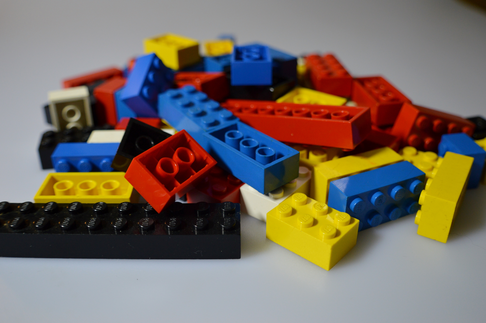
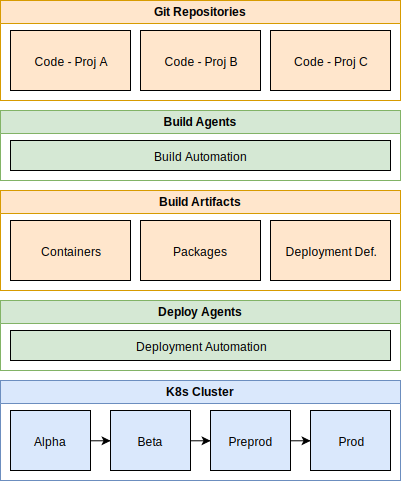

---

title : "K8s CI/CD Pipeline - For Newbs, by Newbs :)"
theme : "league"
transition: "fade"
highlightTheme: "darkula"
logoImg: "images/FFFFFF-0.0.png"
slideNumber: true

---

# K8s CI/CD Pipeline

## For Newbs, by Newbs :)

---

# Agenda

* Core Principles
* Short History
* Approach
* Architecture
* PR Policy
* Build Terminology
* Demo of Build
* Release Terminology
* Demo of Release
* Questions

---

# Core Principles

---

## Failure is normal

---

<small>_just not this kind_</small>

---

<small>_that's better_</small>

---

## Fast is fun

---

---

## Repetition is boring

---

---

## Only need to be right once

---

---

## Decide from power not fear

---

---

# Short History

* Code
* Builds
* Deployments
* Process

---

# Approach

* Iteration Loop - CHEAP!
    * Code
    * Build / Test - local
    * Build / Test - agent
    * Pull Request
    * Deploy
* Comprehension > Complete
* Iterations > Complete

---

# Architecture

---

---

# Pull Request Policy - Demo

[MetadataService Branches](https://metabolondev.visualstudio.com/MsData/_git/MetadataService/branches)

_link only valid for Metabolon Employees_

---

# Build Terminology

* Build
  * Definition
  * Variable
  * Trigger
  * Agent
  * Controller
  * Artifact

---

# Build Demo

[MsData Builds](https://metabolondev.visualstudio.com/MsData/_build)

_link only valid for Metabolon Employees_

---

# Release Terminology

* Release
  * Artifact
  * Stage
  * Deployment

---

# Release Demo

[MsData Releases](https://metabolondev.visualstudio.com/MsData/_release)

_link only valid for Metabolon Employees_

---

# Questions?

* John Goodwin
* Principal Software Engineer, [Metabolon, Inc](https://www.metabolon.com)
* [johngoodwin.com](http://johngoodwin.com)
* [linkedin.com/in/johnhgoodwin](https://linkedin.com/in/johnhgoodwin)
* [john@jjgoodwin.com](mailto:john@jjgoodwin.com)